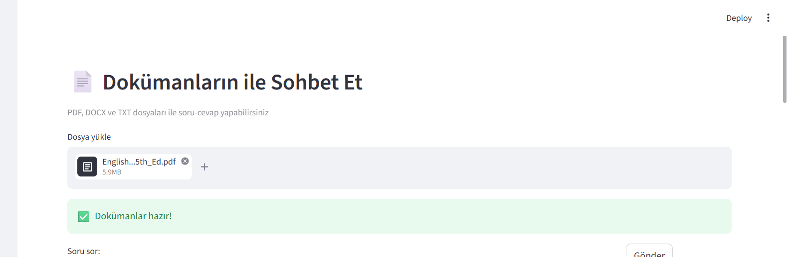
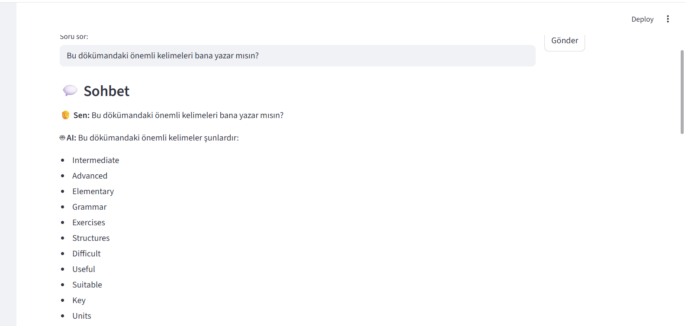
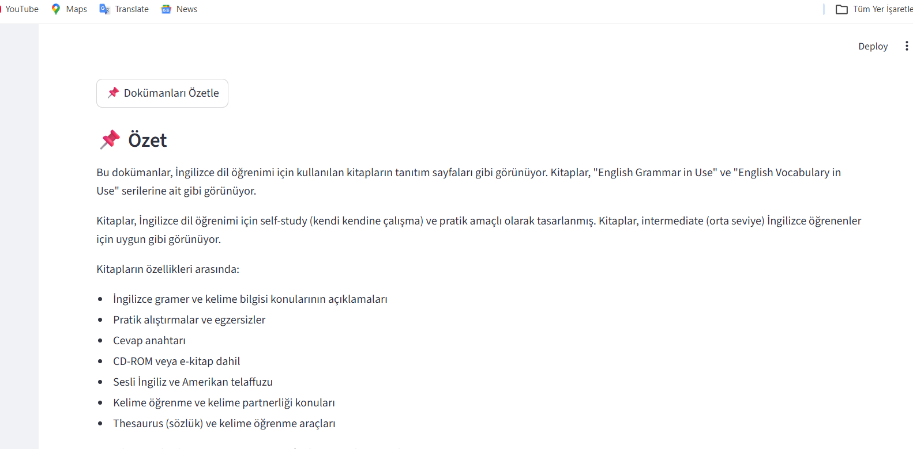

# 📄 Document Chat AI

Bu proje, yüklediğiniz dokümanlar ile sohbet etmenizi sağlayan bir yapay zeka uygulamasıdır.

## 🚀 Özellikler

- PDF, DOCX, TXT dosya yükleme
- Doküman üzerinden soru-cevap
- Otomatik özetleme
- Kaynak gösterme
- RAG (Retrieval-Augmented Generation)

## 🧠 Kullanılan Teknolojiler

- Python
- Streamlit
- LangChain
- ChromaDB
- HuggingFace Embeddings
- Groq LLM

## ⚙️ Kurulum

### 1. Repoyu klonla
git clone https://github.com/donesakizz/document-chat-ai.git

cd document-chat-ai

### 2. Paketleri yükle
pip install -r requirements.txt

### 3. .env oluştur
GROQ_API_KEY=your_api_key_here

### 4. Çalıştır
streamlit run app.py

## 📸 Ekran Görüntüleri

## 🏗️ Mimari

- Doküman yükleme
- Metne çevirme
- Chunking
- Embedding
- Vector DB
- Retrieval
- LLM cevap üretimi

## ✨ Bonus

- Kaynak gösterme
- Çoklu doküman desteği
- Özetleme
